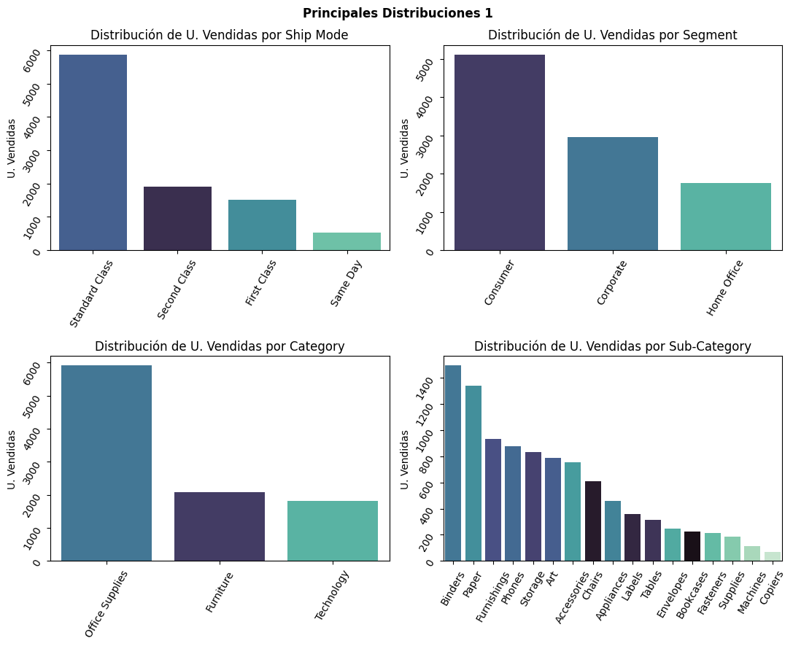
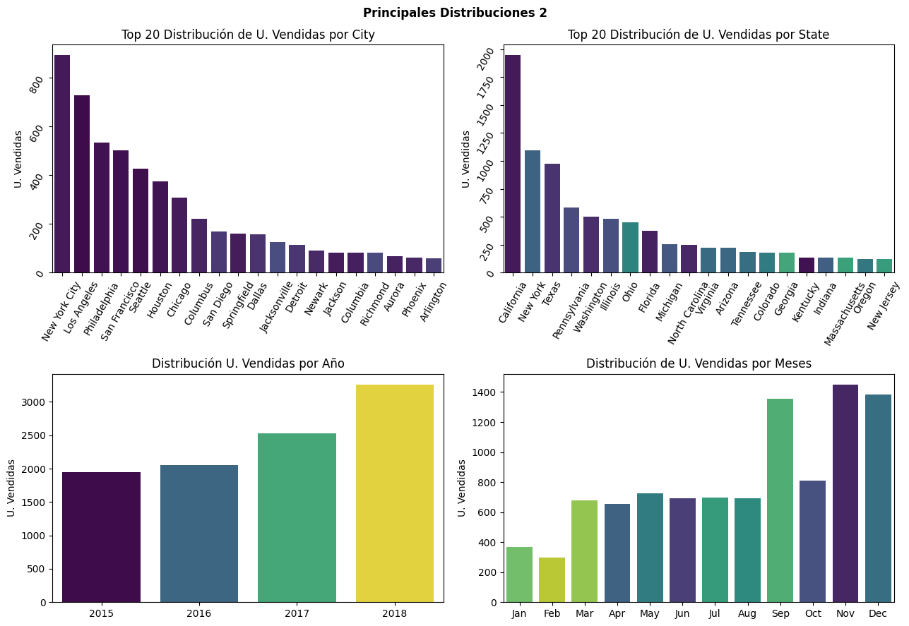
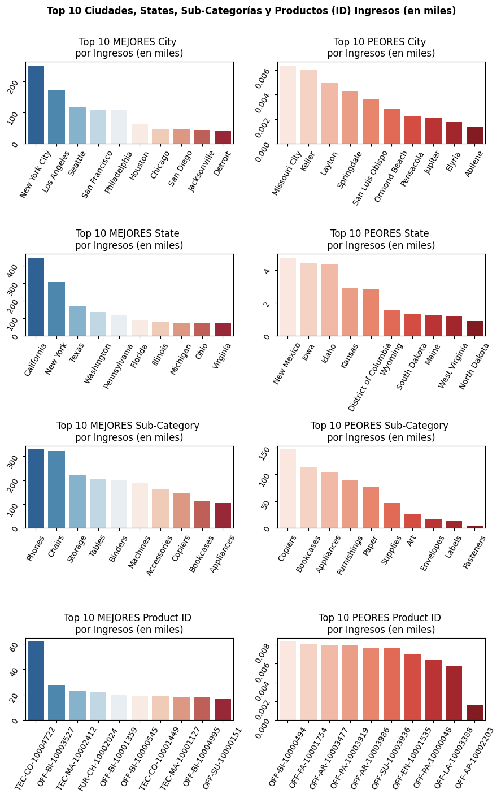
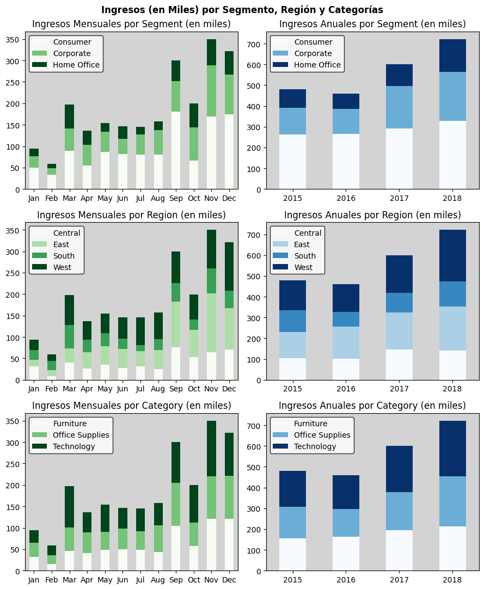
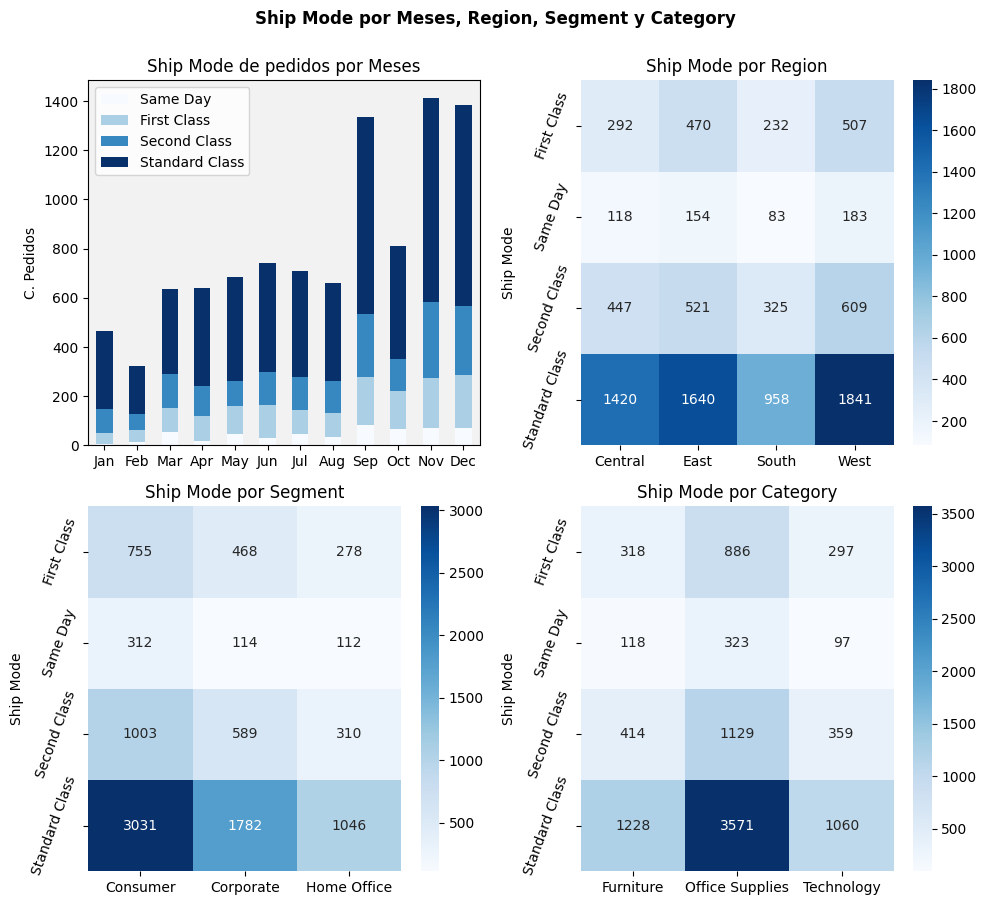
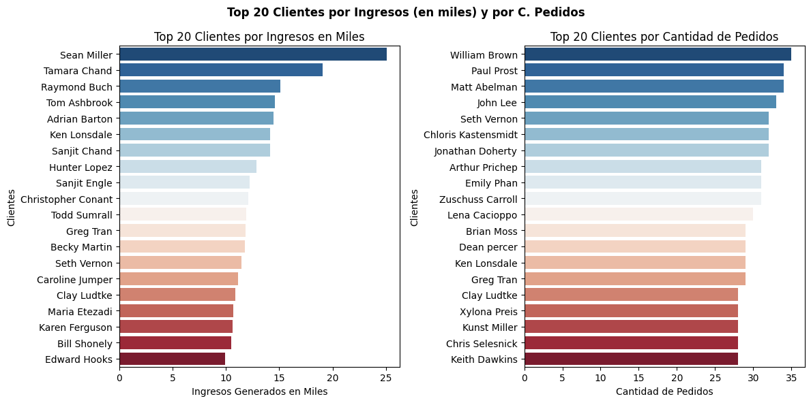
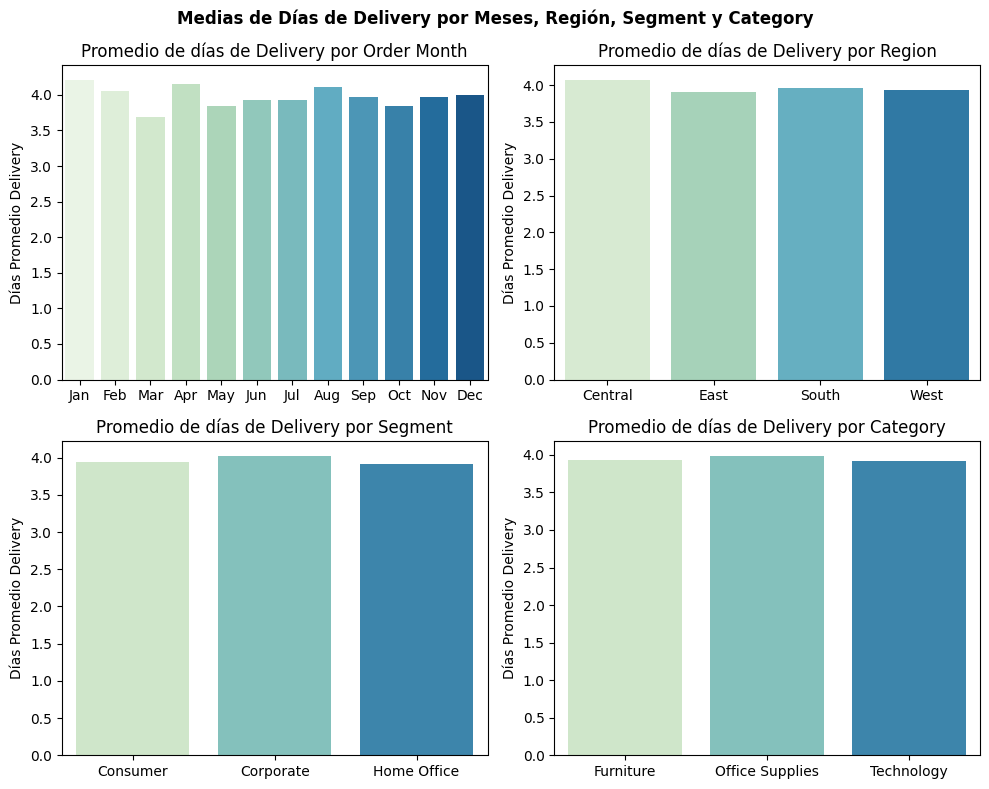

# Análisis Exploratorio de Datos (EDA) de Superstore

## 1. Introducción

Este proyecto tiene como objetivo realizar un Análisis Exploratorio de Datos (EDA) exhaustivo sobre un conjunto de datos de Superstore. El propósito es descubrir patrones, identificar tendencias, detectar anomalías y extraer *insights* valiosos que puedan informar decisiones de negocio estratégicas. Se abordarán aspectos clave como ingresos, estacionalidad, modos de envío, comportamiento del cliente y tiempos de entrega.

## 2. Metodología

La metodología seguida en este análisis se divide en las siguientes fases:

### A. Limpieza de Datos

1.  **Fechas:** Se realizó una revisión y conversión de las columnas de fechas para asegurar un formato consistente y facilitar el análisis temporal.
2.  **Valores Nulos:** Se identificaron y gestionaron los valores nulos presentes en el conjunto de datos, aplicando estrategias adecuadas (ej., imputación, eliminación) según el contexto de cada columna.
3.  **Columna `Row ID`:** Se verificó la unicidad y relevancia de la columna `Row ID` para asegurar que no introdujera ruido o redundancia en el análisis.

### B. Ingeniería de Características

1.  **Meses y Años para Columnas de Fechas:** Se extrajeron el mes y el año de las columnas de fechas (`Order Date`, `Ship Date`) para permitir análisis de estacionalidad y tendencias anuales.
2.  **Conversión de `Sales` a Miles:** La columna de `Sales` se transformó para expresarse en miles, facilitando la interpretación de grandes cifras en los gráficos y tablas.
3.  **`Delivery Days`:** Se calculó una nueva característica, `Delivery Days`, representando la diferencia en días entre la fecha de envío (`Ship Date`) y la fecha de pedido (`Order Date`), crucial para el análisis logístico.

### C. Principales Distribuciones

Se exploró la distribución de las unidades vendidas (`U. Vendidas`) a través de diversas variables categóricas y temporales para entender la composición general de los datos.

* **`Ship Mode`:** Se analizó la frecuencia de cada modo de envío.
* **`Segment`:** Se examinó la distribución de las ventas por segmento de cliente.
* **`Category`:** Se visualizó la distribución de las ventas por categoría de producto.
* **`SubCategory`:** Se profundizó en la distribución de las ventas por subcategoría de producto.
* **`City`:** Se identificaron las ciudades con mayor volumen de unidades vendidas.
* **`State`:** Se determinaron los estados con mayor volumen de unidades vendidas.
* **`Meses`:** Se observó la distribución de las unidades vendidas a lo largo de los meses.
* **`Años`:** Se analizó la tendencia de las unidades vendidas a lo largo de los años.

**Conclusiones de las Distribuciones:**
* **`Ship Mode`:** `Standard Class` es, por lejos, el modo de envío más utilizado, seguido por `Second Class`. `First Class` y `Same Day` son significativamente menos frecuentes.
* **`Segment`:** El segmento `Consumer` domina en unidades vendidas, superando a `Corporate` y `Home Office`.
* **`Category`:** `Office Supplies` es la categoría con mayor volumen de ventas, seguida por `Furniture` y `Technology`.
* **`SubCategory`:** `Binders`, `Paper`, `Furnishings` y `Phones` son las subcategorías con mayor número de unidades vendidas.
* **`City` y `State`:** `New York City` y `California` son las ubicaciones geográficas con mayor volumen de unidades vendidas, respectivamente.
* **Temporal:** Los meses de **septiembre, octubre, noviembre y diciembre** muestran un pico significativo en unidades vendidas, indicando una fuerte estacionalidad de fin de año. El año **2018** registra el mayor volumen de unidades vendidas, mostrando un crecimiento constante a lo largo de los años.

### D. Análisis Exploratorio de Datos (EDA) Detallado

#### a. Ingresos | `Sales` TOP Mayores y Menores

Se analizaron las entidades con los mayores y menores ingresos generados, tanto a nivel geográfico como de producto.

1.  **Ciudad con más/menos Ingresos:** Identificación de las ciudades que más y menos contribuyen a los ingresos.
2.  **Estado con más/menos Ingresos:** Identificación de los estados que más y menos contribuyen a los ingresos.
3.  **Subcategoría con más/menos Ingresos:** Identificación de las subcategorías de productos que generan más y menos ingresos.
4.  **Producto con más/menos Ingresos:** Identificación de los productos específicos que generan más y menos ingresos.

**Conclusiones de Ingresos TOP Mayores y Menores:**
* **Ciudades:** `New York City` es la ciudad con mayores ingresos, mientras que ciudades como `Abilene` y `Eyria` tienen los menores.
* **Estados:** `California` y `New York` son los estados que más ingresos generan.
* **Subcategorías:** `Phones` y `Chairs` son las subcategorías con mayores ingresos, mientras que `Fasteners` y `Labels` son las de menores ingresos.
* **Productos:** Productos específicos como `TEC-CO-10004722` (probablemente un producto de tecnología) son los que más ingresos aportan.

#### b. Estacionalidad | `Sales`

Se examinó cómo los ingresos se distribuyen a lo largo de los meses y años, desglosados por segmento, región y categoría.

1.  **Categoría x Meses y Años:** Tendencias de ingresos por categoría a lo largo del tiempo.
2.  **Segmento x Meses y Años:** Tendencias de ingresos por segmento a lo largo del tiempo.
3.  **Región x Meses y Años:** Tendencias de ingresos por región a lo largo del tiempo.

**Conclusiones de Estacionalidad de Ingresos:**
* **General:** Existe una clara estacionalidad, con los **últimos meses del año (septiembre, octubre, noviembre, diciembre)** mostrando consistentemente los mayores ingresos mensuales en todas las dimensiones.
* **Tendencia Anual:** Los ingresos han mostrado un **crecimiento constante año tras año**, siendo 2018 el año con el mayor volumen de ingresos.
* **Por Segmento:** El segmento `Consumer` contribuye consistentemente con la mayor parte de los ingresos, tanto mensual como anualmente.
* **Por Región:** La región `West` y `East` son las que más ingresos generan, con un comportamiento estacional similar al general.
* **Por Categoría:** `Technology` y `Office Supplies` son las categorías que más ingresos aportan, manteniendo la tendencia estacional de fin de año.

#### c. `Ship Mode` | Conteo de Pedidos

Se analizó la distribución de los modos de envío en relación con el tiempo y otras variables categóricas.

1.  **`Ship Mode` x Meses:** Distribución de modos de envío a lo largo de los meses.
2.  **`Ship Mode` x Segmento:** Distribución de modos de envío por segmento de cliente.
3.  **`Ship Mode` x Región:** Distribución de modos de envío por región.
4.  **`Ship Mode` x Categoría:** Distribución de modos de envío por categoría de producto.

**Conclusiones de `Ship Mode`:**
* **Por Meses:** El `Standard Class` es el modo de envío predominante en todos los meses, con un aumento notable en el volumen de pedidos hacia el final del año, reflejando la estacionalidad de ventas.
* **Por Región, Segmento y Categoría:** `Standard Class` es el modo de envío más utilizado en todas las regiones, segmentos y categorías, lo que sugiere una preferencia generalizada o una oferta limitada de opciones de envío más rápidas. Los modos de envío más rápidos (`Same Day`, `First Class`) tienen un volumen de uso significativamente menor en todas las dimensiones.

#### d. Clientes

Se identificaron los clientes más importantes basándose en los ingresos generados y el número de pedidos realizados.

1.  **Top clientes por Ingresos:** Clientes que han generado los mayores ingresos.
2.  **Top clientes por número de Pedidos:** Clientes que han realizado la mayor cantidad de pedidos.

**Conclusiones sobre Clientes:**
* Existe un grupo de clientes `Top 20` que son responsables de una parte significativa de los ingresos y el número de pedidos.
* Algunos clientes aparecen en ambas listas (`Top 20` por Ingresos y por Pedidos), lo que indica su alto valor tanto en volumen de compra como en frecuencia. Esto es crucial para programas de fidelización.

#### e. Tiempos de Entrega

Se analizó el promedio de días de entrega en función de diferentes variables.

1.  **Tiempo medio por Meses:** Promedio de días de entrega a lo largo de los meses.
2.  **Tiempo medio por Región:** Promedio de días de entrega por región.
3.  **Tiempo medio por Segmento:** Promedio de días de entrega por segmento de cliente.
4.  **Tiempo medio por Categoría:** Promedio de días de entrega por categoría de producto.

**Conclusiones de Tiempos de Entrega:**
* **Por Meses:** Los días promedio de entrega se mantienen relativamente estables a lo largo del año, con ligeras variaciones. No hay una estacionalidad marcada en los tiempos de entrega promedio, lo cual es positivo para la consistencia logística.
* **Por Región, Segmento y Categoría:** Los promedios de días de entrega son muy similares entre las diferentes regiones, segmentos y categorías de productos. Esto sugiere que el sistema de entrega es bastante uniforme y no presenta cuellos de botella significativos asociados a estas dimensiones. Los tiempos de entrega promedio parecen oscilar alrededor de los 4 días.

## 3. Conclusiones Generales y Recomendaciones

El análisis exploratorio de datos ha revelado varios *insights* clave sobre el rendimiento de Superstore:

* **Estacionalidad de Ventas:** Los últimos meses del año (septiembre a diciembre) son cruciales para el negocio, registrando los mayores volúmenes de ventas e ingresos. Se recomienda planificar campañas de marketing y optimizar el inventario para aprovechar este pico.
* **Crecimiento Sostenido:** La empresa ha experimentado un crecimiento constante en ingresos y unidades vendidas año tras año, lo que es un indicador positivo de su expansión.
* **Dominio de `Standard Class`:** Este modo de envío es abrumadoramente el más utilizado. Esto podría ser una oportunidad para:
    * **Optimizar costos:** Negociar mejores tarifas con los proveedores de envío `Standard Class`.
    * **Explorar opciones premium:** Evaluar la demanda y la rentabilidad de promocionar más agresivamente los modos de envío más rápidos (`First Class`, `Same Day`), quizás ofreciendo incentivos o destacando sus beneficios.
* **Clientes de Alto Valor:** Identificar y nutrir a los clientes `Top 20` es fundamental para la retención y el crecimiento. Se podrían implementar programas de lealtad o comunicaciones personalizadas.
* **Consistencia en Tiempos de Entrega:** La uniformidad en los días de entrega promedio en todas las dimensiones es una fortaleza operativa. Esto asegura una experiencia de cliente predecible.
* **Oportunidades de Categoría/Subcategoría:** `Office Supplies` y `Technology` son categorías clave. Dentro de `Office Supplies`, `Binders` y `Paper` son subcategorías con alto volumen. `Phones` y `Chairs` son las que más ingresos generan. Esto puede guiar estrategias de inventario, marketing y desarrollo de productos.
* **Foco Geográfico:** `New York City` y `California` son mercados de alto rendimiento que merecen atención continua y posiblemente inversiones dirigidas.

Este EDA proporciona una base sólida para análisis más profundos, como modelado predictivo de ventas, optimización de la cadena de suministro o segmentación de clientes más avanzada.

## 🧑‍💻 Autor

[Christian Vizcardo]
[www.linkedin.com/in/christian-vizcardo]